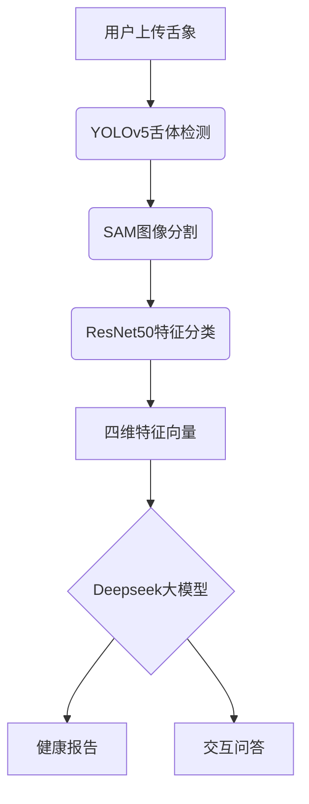

# 舌诊宝：中医舌象诊断AI助手 🩺🤖

[](https://opensource.org/licenses/MIT)
[](https://www.python.org/)
[](https://docs.conda.io/)

> 基于深度学习的多模态舌象分析系统，融合目标检测、图像分割与语言大模型，提供智能化中医舌诊服务。

---

## 📌 核心功能

### 1.0 版本核心
- **四维舌象分析**  
  通过多模型协同工作，精准识别舌色、舌苔色、薄厚、腻否四大关键指标
- **全流程自动化处理**  
  `YOLOv5` 舌体定位 → `Segment Anything` 高精度分割 → `ResNet50` 特征分类
- **跨平台Web应用**  
  支持浏览器直接访问，适配Windows/macOS/Linux系统

### 2.0 版本升级 ✨
- **智能问诊引擎**  
  集成深度求索 `Deepseek-r1-14B` 语言大模型，支持：
  - 基于舌象特征的多维度健康评估
  - 自然语言交互式健康咨询
  - 语音输入输出（需Chrome内核浏览器）

---

## 🚀 快速开始

### 环境要求
- Conda ≥23.10.0
- Python 3.9.21
- SQLite 3.35+

### 后端部署
```bash
# 克隆仓库
git clone https://github.com/your-repo/TongueDiagnosis.git
cd TongueDiagnosis/application

# 安装依赖
conda create -n tongueai python=3.9.21
conda activate tongueai
pip install -r requirements.txt

# 数据库初始化
sqlite3 tongue.db < models/create_ChatRecord.sql  # 自动创建4张数据表
sqlite3 tongue.db < models/create_Session.sql  # 自动创建4张数据表
sqlite3 tongue.db < models/create_TongueDiagnosis.sql  # 自动创建4张数据表
sqlite3 tongue.db < models/User.sql  # 自动创建4张数据表

# 新建目录
mkdir -Force ./net/weights/

# 模型权重配置 （终端无法运行的话请手动下载权重文件，共7个）
wget -P ./net/weights/ \
  "https://github.com/TonguePicture-SKaRD/TongueDiagnosis/releases/download/V1.0_Beta/rot_and_greasy.pth" \
  "https://github.com/TonguePicture-SKaRD/TongueDiagnosis/releases/download/V1.0_Beta/thickness.pth" \
  "https://github.com/TonguePicture-SKaRD/TongueDiagnosis/releases/download/V1.0_Beta/tongue_coat_color.pth" \
  "https://github.com/TonguePicture-SKaRD/TongueDiagnosis/releases/download/V1.0_Beta/tongue_color.pth" \
  "https://github.com/TonguePicture-SKaRD/TongueDiagnosis/releases/download/V1.0_Beta/unet.pth" \
  "https://github.com/TonguePicture-SKaRD/TongueDiagnosis/releases/download/V1.0_Beta/yolov5.pt" \
  "https://dl.fbaipublicfiles.com/segment_anything/sam_vit_b_01ec64.pth"

# 启动服务
cd..
python run.py
```

### 前端启动
#### 方式一：预编译版本
```bash
npm run build
./frontend/tongue_diagnosis.exe  # Windows
```

#### 方式二：源码启动
##### 检查在 ./public 目录是否存在一个叫tongue 的文件夹，如果不存在，需要用户手动新建这个空文件夹。
```bash
cd frontend
npm install
npm run build
# Electron桌面端
npm run electron:start

# Web浏览器端（推荐Chrome）
npm run dev
```

---

## 🧩 项目架构

### 系统流程图
在做所有操作之前，必须先在左上角先写一个标题，用于开启这次对话。


### 目录结构
```
TongueDiagnosis/
├── application/          # 后端核心
│   ├── config/           - 服务配置
│   ├── core/             - 算法实现
│   │   ├── detection.py  -- YOLOv5舌体定位
│   │   ├── segmentation.py -- SAM图像分割
│   │   └── analysis.py   -- ResNet50分类模型
│   ├── net/weights/      - 模型权重文件
│   └── routes/           - API路由
├── frontend/             # 前端工程
│   ├── src/              - Vue3源码
│   │   ├── views/        -- 页面组件
│   │   └── services/     -- API服务层
│   └── electron/         - 桌面端封装
└── docs/                 # 文档资源
```

---

## 🤝 参与贡献

我们欢迎任何形式的贡献！请遵循以下流程：
1. Fork 本仓库
2. 创建特性分支 (`git checkout -b feature/your-feature`)
3. 提交修改 (`git commit -m 'Add some feature'`)
4. 推送分支 (`git push origin feature/your-feature`)
5. 提交 Pull Request

**问题反馈**：[新建Issue](https://github.com/TonguePicture-SKaRD/TongueDiagnosis/issues)

---

## 📜 许可证
本项目采用 [AGPL-3.0 license](LICENSE)，部分模型权重文件需遵循原始协议：
- SAM 模型遵循 [Apache 2.0](https://github.com/facebookresearch/segment-anything/blob/main/LICENSE)
- Deepseek 模型遵循 [官方协议](https://www.deepseek.com/terms)

---

> 🌱 本项目历经18个月迭代开发，凝聚开发团队五名成员的心血。如有任何建议，欢迎通过 [讨论区](https://github.com/TonguePicture-SKaRD/TongueDiagnosis/discussions/20) 与我们交流！
