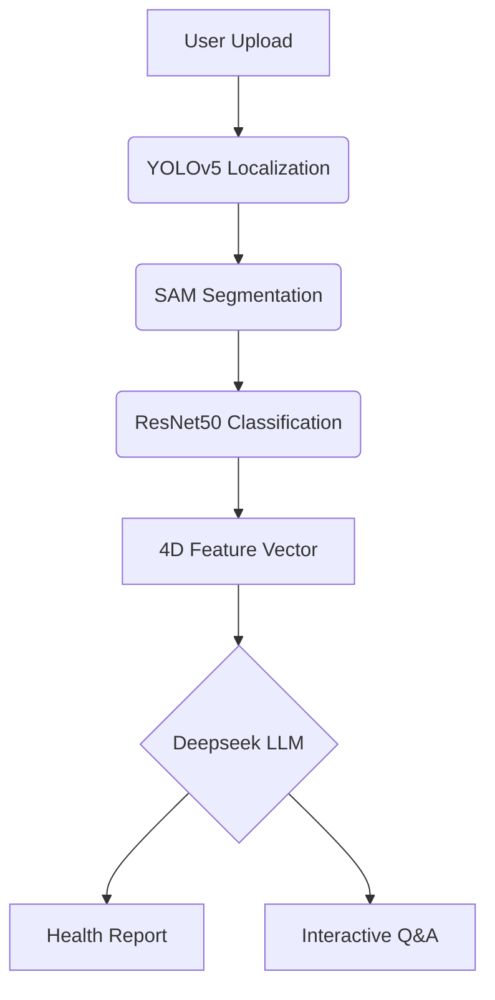

# TongueDiagnosis.AI: TCM Tongue Image Diagnosis Assistant 🩺🤖

[](https://www.gnu.org/licenses/agpl-3.0)
[](https://www.python.org/)
[](https://docs.conda.io/)   
Chinese(中文版本): [Readme_cn.md](https://github.com/TonguePicture-SKaRD/TongueDiagnosis/blob/master/Document/Readme_cn.md)

> A multimodal tongue image analysis system powered by deep learning, integrating object detection, image segmentation, and LLMs for intelligent TCM tongue diagnosis.

---

## 📌 Core Features

### Version 1.0 Foundation
- **Four-Dimensional Analysis**  
  Precise identification of tongue color, coating color, thickness, and greasiness
- **Automated Processing Pipeline**  
  `YOLOv5` tongue localization → `Segment Anything` segmentation → `ResNet50` classification
- **Cross-Platform Web App**  
  Browser-based access supporting Windows/macOS/Linux

### Version 2.0 Enhancements ✨
- **Intelligent Diagnosis Engine**  
  Integrated Deepseek `Deepseek-r1-14B` LLM enables:
  - Multidimensional health assessment
  - Natural language Q&A consultation
  - Voice I/O (Chrome-based browsers required)

---

## 🚀 Quick Start

### Requirements
- Conda ≥23.10.0
- Python 3.9.21
- SQLite 3.35+

### Backend Setup
```bash
# Clone repository
git clone https://github.com/your-repo/TongueDiagnosis.git
cd TongueDiagnosis/application

# Create environment
conda create -n tongueai python=3.9.21
conda activate tongueai
pip install -r requirements.txt

# Initialize database
sqlite3 tongue.db < models/create_ChatRecord.sql  # Creates 4 tables
sqlite3 tongue.db < models/create_Session.sql  # Creates 4 tables
sqlite3 tongue.db < models/create_TongueDiagnosis.sql  # Creates 4 tables
sqlite3 tongue.db < models/User.sql  # Creates 4 tables

# Make a directory 
mkdir -Force ./net/weights/

# Download model weights (If the terminal cannot run, please manually download the weight file, a total of 7)
wget -P ./net/weights/ \
  "https://github.com/TonguePicture-SKaRD/TongueDiagnosis/releases/download/V1.0_Beta/rot_and_greasy.pth" \
  "https://github.com/TonguePicture-SKaRD/TongueDiagnosis/releases/download/V1.0_Beta/thickness.pth" \
  "https://github.com/TonguePicture-SKaRD/TongueDiagnosis/releases/download/V1.0_Beta/tongue_coat_color.pth" \
  "https://github.com/TonguePicture-SKaRD/TongueDiagnosis/releases/download/V1.0_Beta/tongue_color.pth" \
  "https://github.com/TonguePicture-SKaRD/TongueDiagnosis/releases/download/V1.0_Beta/unet.pth" \
  "https://github.com/TonguePicture-SKaRD/TongueDiagnosis/releases/download/V1.0_Beta/yolov5.pt" \
  "https://dl.fbaipublicfiles.com/segment_anything/sam_vit_b_01ec64.pth"

# Launch backend
cd..
python run.py
```

### Frontend Launch
#### Option 1: Prebuilt Executable
```bash
npm run build
./frontend/tongue_diagnosis.exe  # Windows
```

#### Option 2: Source Code
##### Before starting, ensure a "tongue" folder exists in ./public directory (create if missing)
```bash
cd frontend
npm install
npm run build
# Electron desktop
npm run electron:start

# Web browser (Chrome recommended)
npm run dev
```

---

## 🧩 Architecture

### Workflow


### Directory Structure
```
TongueDiagnosis/
├── application/          # Backend Core
│   ├── config/           - Service Configuration
│   ├── core/             - Algorithms
│   │   ├── detection.py  -- YOLOv5 Localization
│   │   ├── segmentation.py -- SAM Segmentation
│   │   └── analysis.py   -- ResNet50 Classification
│   ├── net/weights/      - Model Weights
│   └── routes/           - API Routes
├── frontend/             # Frontend Project
│   ├── src/              - Vue3 Source
│   │   ├── views/        -- Page Components
│   │   └── services/     -- API Services
│   └── electron/         - Desktop Wrapper
└── docs/                 # Documentation
```

---

## 🤝 Contribution

We welcome contributions! Please follow this workflow:
1. Fork the repository
2. Create feature branch (`git checkout -b feature/your-feature`)
3. Commit changes (`git commit -m 'Add some feature'`)
4. Push branch (`git push origin feature/your-feature`)
5. Open Pull Request

**Issue Reporting**: [New Issue](https://github.com/TonguePicture-SKaRD/TongueDiagnosis/issues)

---

## 📜 License

This project is licensed under [AGPL-3.0](LICENSE). Third-party model weights follow original licenses:
- SAM Model: [Apache 2.0](https://github.com/facebookresearch/segment-anything/blob/main/LICENSE)
- Deepseek Model: [Official License](https://www.deepseek.com/terms)

---

> 🌱 Developed over 18 months by a dedicated team of five. Join our [Discussions](https://github.com/TonguePicture-SKaRD/TongueDiagnosis/discussions/20) to share feedback!