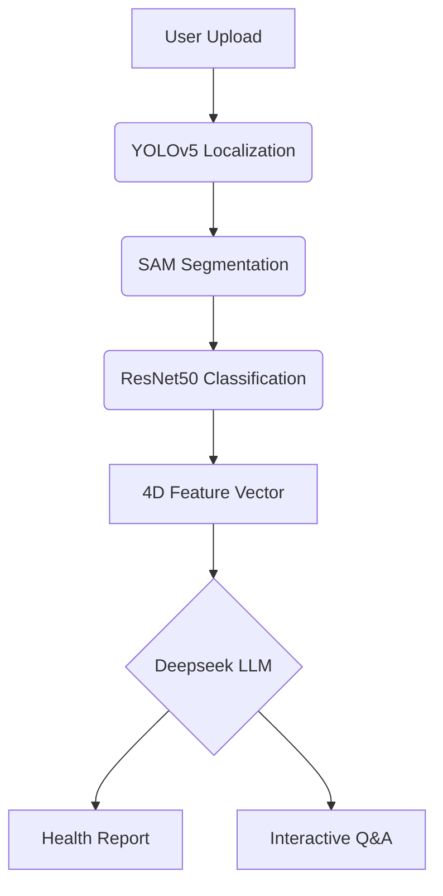

# TongueDiagnosis.AI: TCM Tongue Image Diagnosis Assistant 🩺🤖

[](https://www.gnu.org/licenses/agpl-3.0)
[](https://www.python.org/)
[](https://docs.conda.io/)

> A multimodal tongue image analysis system powered by deep learning, integrating object detection, image segmentation, and LLMs for intelligent TCM tongue diagnosis.

---

## 📌 Core Features

### Version 1.0 Foundation
- **Four-Dimensional Analysis**  
  Precise identification of tongue color, coating color, thickness, and greasiness
- **Automated Processing Pipeline**  
  `YOLOv5` tongue localization → `Segment Anything` segmentation → `ResNet50` classification
- **Cross-Platform Web App**  
  Browser-based access supporting Windows/macOS/Linux

### Version 2.0 Enhancements ✨
- **Intelligent Diagnosis Engine**  
  Integrated Deepseek `Deepseek-r1-14B` LLM enables:
  - Multidimensional health assessment
  - Natural language Q&A consultation

---

## 🚀 Quick Start

### Requirements
- Conda ≥23.10.0
- Python 3.9.21
- SQLite 3.35+

### Configuration
#### Backend Configuration
- Modify `application/config/config.py` to set backend parameters:
  - ACCESS_TOKEN_EXPIRE_MINUTES: Token expiration time in minutes
  - SECRET_KEY: Secret key for JWT token generation
  - ALGORITHMS: Algorithm used for JWT token encoding
  - IMG_PATH: Path to save uploaded tongue images
  - IMG_DB_PATH: Path stored in the database for tongue images
  - OLLAMA_PATH: Ollama API endpoint
  - SYSTEM_PROMPT: System prompt for LLM
  - LLM_NAME: Name of the LLM model to use in Ollama
  - APP_PORT: Port for backend server
- Default configuration:
```bash
    ACCESS_TOKEN_EXPIRE_MINUTES: int = 60 * 24
    SECRET_KEY: str = "f2e1f1b1c1a1"
    ALGORITHMS: str = "HS256"
    IMG_PATH: str = "frontend/public/tongue"
    IMG_DB_PATH: str = "tongue"
    OLLAMA_PATH: str = "http://localhost:11434/api/chat"
    SYSTEM_PROMPT: str = "You are now an AI traditional Chinese medicine doctor specializing in tongue diagnosis. At the very beginning, I will show you four image features of the user's tongue. Please use your knowledge of traditional Chinese medicine to give the user some suggestions. Answer in English"
    LLM_NAME: str = "deepseek-r1:14b"
    APP_PORT: int = 5000
```
#### Frontend Configuration
- Modify `application/config/config.py` to set backend parameters:
  - ServerUrl: Backend server URL
- Default configuration:
```javascript
export const settings = {
    ServerUrl: 'http://localhost:5000'
};

export default settings;
```

### Backend Setup
Default running port: 5000

Before the following step, you need to install Ollama[https://ollama.com/download]  on the device which will run the backend application.
```bash
# Clone repository
git clone https://github.com/TonguePicture-SKaRD/TongueDiagnosis.git
cd TongueDiagnosis/application

# Create environment
conda create -n tongueai python=3.9.21
conda activate tongueai
cd ..
pip install -r requirements.txt

# Initialize database
sqlite3 AppDatabase.db < models/create_ChatRecord.sql  # Creates 4 tables
sqlite3 AppDatabase.db < models/create_Session.sql  # Creates 4 tables
sqlite3 AppDatabase.db < models/create_TongueAnalysis.sql  # Creates 4 tables
sqlite3 AppDatabase.db < models/create_User.sql  # Creates 4 tables

# Make a directory for saving model weights
cd application
mkdir -p ./net/weights

# Make a directory for tongue images saving
cd ../frontend/public
mkdir -p ./tongue

# Download model weights (If the terminal cannot run, please manually download the weight file, a total of 7)
wget -P ./net/weights/ \
  "https://github.com/TonguePicture-SKaRD/TongueDiagnosis/releases/download/V1.0_Beta/rot_and_greasy.pth" \
  "https://github.com/TonguePicture-SKaRD/TongueDiagnosis/releases/download/V1.0_Beta/thickness.pth" \
  "https://github.com/TonguePicture-SKaRD/TongueDiagnosis/releases/download/V1.0_Beta/tongue_coat_color.pth" \
  "https://github.com/TonguePicture-SKaRD/TongueDiagnosis/releases/download/V1.0_Beta/tongue_color.pth" \
  "https://github.com/TonguePicture-SKaRD/TongueDiagnosis/releases/download/V1.0_Beta/unet.pth" \
  "https://github.com/TonguePicture-SKaRD/TongueDiagnosis/releases/download/V1.0_Beta/yolov5.pt" \
  "https://dl.fbaipublicfiles.com/segment_anything/sam_vit_b_01ec64.pth"

# Launch backend
cd..
python run.py
```

### Frontend Setup
Default running port (dev mode): 5173

Default running port (preview mode): 4173

Before starting, ensure a "tongue" folder exists in ./public directory (create if missing)
```bash
# Web Application
cd frontend
npm install
npm run build
npm run preview

# Electron Desktop
npm run electron:build
npm run electron:start

# Web browser (Chrome recommended)
npm run dev
```

---

## 🧩 Architecture

### Workflow


### Directory Structure
```
TongueDiagnosisEN
├─── .gitattributes                      # Defines Git attribute rules and file handling behaviors
├─── .gitignore                          # Specifies files and directories to exclude from Git tracking
├─── LICENSE                             # Legal license terms for the project
├─── Readme.md                           # Project documentation and usage instructions
├─── requirements.txt                    # Python dependencies for the backend application
├─── run.py                              # Main entry point to start the application server
├─── application/                        # Backend Python package
│   ├─── __init__.py                     # Initializes the application as a Python package
│   ├─── config/                         # Configuration management module
│   ├─── core/                           # Core utilities and business logic
│   ├─── models/                         # Data models and database schema
│   ├─── net/                            # Neural network and deep learning components
│   │   ├─── __init__.py                 # Package initialization for neural network module
│   │   ├─── predict.py                  # Functions for performing predictions using ML models
│   │   ├─── model/                      # Deep learning model architectures
│   │   └─── weights/                    # Pre-trained model weight files (binary files)
│   ├─── orm/                            # Object-relational mapping and database operations
│   │   ├─── __init__.py                 # Package initialization for ORM module
│   │   ├─── database.py                 # Database session management and connection pool
│   │   └─── crud/                       # CRUD (Create, Read, Update, Delete) operations
│   └─── routes/                         # API route handlers
└─── frontend/                           # Client-side Vue.js application
    ├─── .gitignore                      # Git ignore rules specific to frontend files
    ├─── auto-imports.d.ts               # TypeScript definitions for auto-imported modules
    ├─── components.d.ts                 # TypeScript definitions for automatically registered components
    ├─── cypress.config.js               # Configuration for end-to-end testing framework
    ├─── index.html                      # Main HTML template for the Vue application
    ├─── jsconfig.json                   # JavaScript compiler options and configuration
    ├─── main.js                         # Entry point for the Vue.js application
    ├─── package-lock.json               # Exact versions of frontend dependencies for reproducibility
    ├─── package.json                    # Frontend dependencies, scripts, and project metadata
    ├─── README.md                       # Frontend-specific documentation and usage guide
    ├─── vite.config.js                  # Configuration for Vite build tool and development server
    ├─── vitest.config.js                # Unit testing framework configuration
    ├─── cypress/                        # End-to-end test files and configurations
    ├─── public/                         # Static assets served directly by the web server
    └─── src/                            # Source code for the Vue.js application
```

## 🤝 Contribution

We welcome contributions! Please follow this workflow:
1. Fork the repository
2. Create feature branch (`git checkout -b feature/your-feature`)
3. Commit changes (`git commit -m 'Add some feature'`)
4. Push branch (`git push origin feature/your-feature`)
5. Open Pull Request

**Issue Reporting**: [New Issue](https://github.com/TonguePicture-SKaRD/TongueDiagnosis/issues)

---

## 📜 License

This project is licensed under [AGPL-3.0](LICENSE). Third-party model weights follow original licenses:
- SAM Model: [Apache 2.0](https://github.com/facebookresearch/segment-anything/blob/main/LICENSE)
- Deepseek Model: [Official License](https://www.deepseek.com/terms)
